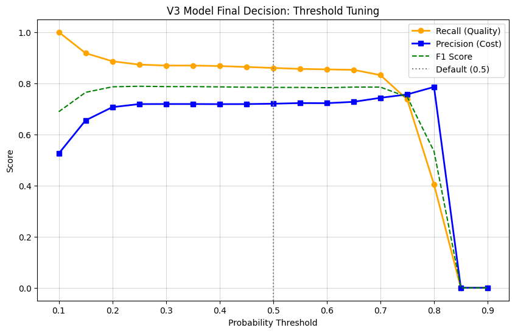
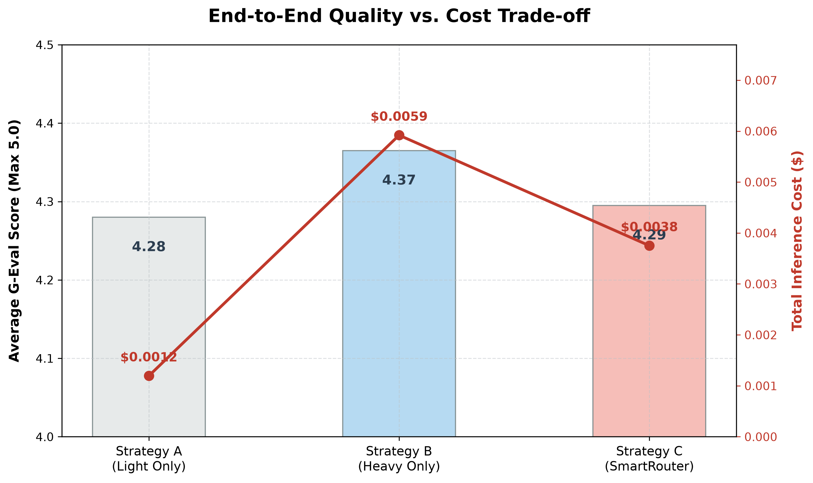
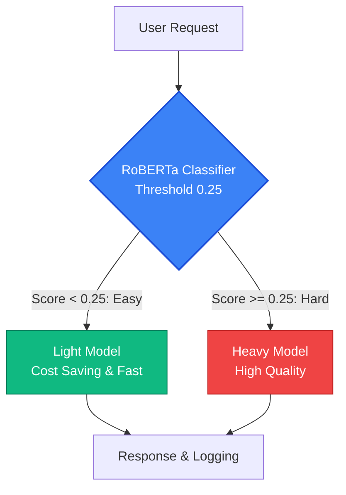

# 🧠 SmartRouter: LLM Dynamic Routing Pipeline

SmartRouter는 LLM 서비스의 **Inference Cost**와 **Quality** 간의 트레이드오프 문제를 완화하기 위해 설계된 **Dynamic Routing System**입니다. 

모든 요청을 고비용의 대형 모델로 처리하는 대신, **RoBERTa Classifier**를 활용하여 입력 문장의 난이도를 사전 예측했습니다. 이를 통해 난이도가 낮은 문장은 경량 모델로, 복잡한 문장은 대형 모델로 분기하는 로직을 구현했습니다.

---

## 📊 Background & Results

### 🔍 Problem Definition
*   **AS-IS**: 기존 텍스트 교정 서비스는 비용 절감을 위해 대부분의 요청을 경량 모델로 일괄 처리했습니다.
*   **Problem**: 학술 논문이나 비즈니스 이메일 등 난이도가 높은 텍스트(**Hard Sentence**)에서 품질 저하가 발생하여 **Churn** 리스크가 존재했습니다. 반면 전체 트래픽을 대형 모델로 일괄 전환하면 Inference Cost가 과도하게 상승하는 병목 현상이 있었습니다.
*   **TO-BE**: 사용자의 문맥과 난이도를 학습 기반으로 분류하여, 각 모델의 장점을 살릴 수 있는 동적 라우팅 파이프라인을 구축했습니다.

### 🏆 Key Results
*   **Cost**: 대형 모델 단독 처리 대비 평균 **36.6% 절감**을 확인했습니다. (실제 서비스 트래픽 비율을 가정한 시뮬레이션에서는 60~80% 수준의 절감을 기대할 수 있습니다.)
*   **Quality**: 블라인드 테스트 결과, 대형 모델 단독 처리 대비 **98.4% 수준의 품질을 방어**했습니다.
*   **Latency**: 난이도가 낮은 문장은 경량 모델로 신속하게 반환하여, 서비스의 전체적인 평균 응답 속도를 개선했습니다.

---

## ⚙️ Phase 1: Threshold Tuning

분류기가 보수적으로 판별하여 대형 모델 호출을 늘리면 Quality는 보장되지만 Cost가 크게 상승합니다. 이 교차점을 합리적으로 설정하기 위해 **Threshold Tuning**을 진행했습니다.



- **Recall**: 실제 어려운 문장을 대형 모델로 안전하게 전달할 확률입니다.
- **Precision**: 대형 모델로 라우팅된 문장이 정말로 어려운 문장일 확률입니다.
- 두 지표를 조율하여 F1 Score가 가장 높은 지점인 **Threshold = 0.25**를 최적의 기본값으로 적용했습니다. (모델의 분류 Accuracy 값과는 독립적인 파라미터입니다.)

### ⚖️ Phase 2: End-to-End Validation (G-Eval)

분류기의 성능 평가에 그치지 않고, 사용자에게 도달하는 최종 텍스트의 **Quality**를 직접 검증했습니다. 100건의 샘플을 층화 추출한 뒤, **LLM-as-a-Judge (G-Eval)** 방식을 적용해 블라인드 채점을 수행했습니다.



| Strategy | Average G-Eval Score | Total Cost | Analysis |
| :--- | :---: | :---: | :--- |
| **A. Light Only** | 4.28 | $ 0.0012 | 가장 저렴하지만, 복잡한 맥락에서 품질 저하 리스크가 존재합니다. |
| **B. Heavy Only** | 4.37 | $ 0.0059 | 가장 우수한 품질을 보여주나, API 비용 부담이 높습니다. |
| **C. SmartRouter** | **4.30** | **$ 0.0038** | **98.4%의 Quality를 유지하며 Cost를 36.6% 절감**했습니다. |

해당 검증 과정과 분석은 [`research/08_final_evaluation.ipynb`](research/08_final_evaluation.ipynb) 노트북에 정리했습니다.

---

## 🛠️ Architecture



### 1. Separation of Concerns (Research vs. Production)
*   **`research/`**: 데이터 분석 및 Threshold Tuning과 같은 탐색적 실험 과정을 Jupyter Notebook 환경으로 분리하여 기록했습니다.
*   **`src/`**: 실험에서 도출된 파라미터를 바탕으로, 배포 및 운영이 가능하도록 FastAPI 기반의 **Async** 서비스 로직으로 재구성하여 구현했습니다.

### 2. Extensibility (Base Class)
*   추후 다른 머신러닝 분류 모델이나 Rule-based 라우터가 도입될 수 있는 상황을 가정하여, `BaseRouter`라는 **Abstract Base Class**를 정의했습니다. 이를 통해 기존 API 레이어를 수정하지 않고 새로운 라우팅 엔진을 안전하게 교체(Dependency Injection)할 수 있도록 코드를 설계했습니다.

---

## 🗂️ Directory Structure

```text
SmartRouter_Pipeline/
├── research/                  # 데이터 전처리 및 모델링 실험 코드를 정리한 공간
│   ├── 01_data_preprocessing.ipynb
│   ├── 05_model_training_final.ipynb
│   ├── 06_threshold_tuning.ipynb
│   └── ...
├── data/                      # 훈련용/검증용 데이터셋
├── models/                    # 학습된 로컬 가중치 파일
├── src/                       # 운영 레벨의 FastAPI 서버 소스코드
│   └── smartrouter/
│       ├── main.py
│       ├── api/routes.py      # /evaluate 및 서비스 API 엔드포인트
│       ├── core/config.py     # 환경 변수 및 설정 분리
│       ├── router/dynamic.py  # RoBERTa 기반 라우팅 구현체
│       └── services/          # AWS Bedrock 등 외부 연동 클라이언트
├── tests/                     # Pytest 기반 단위 검증 코드
├── scripts/                   # 자동화 및 인프라 배포를 가정하여 작성한 참고용 스크립트
├── Dockerfile                 # 도커 빌드용 스펙 파일
└── pyproject.toml             # uv 패키지 환경 정의
```

---

## 🚀 Quick Start

빠른 의존성 관리를 위해 `uv`를 활용하여 환경을 구성했습니다.

### 1. Installation
```bash
# uv 설치
pip install uv

# 가상환경 생성 및 패키지 설치
uv venv
uv pip install -e .
```

### 2. Run Server
```bash
# uvicorn 구동
uv run python -m uvicorn smartrouter.main:app --reload --port 8000
```
*   서버가 구동되면 `http://localhost:8000`에서 인터랙티브 테스트 화면을 확인해 볼 수 있습니다.
*   `http://localhost:8000/docs` 경로를 통해 API 스펙을 확인하고 수동으로 테스트할 수 있습니다.

### 3. Mock Mode
*   `.env`에 AWS API 연동 값이 없는 경우에도 에러로 멈추지 않고, **Mock Mode**로 부드럽게 전환되도록 예외 처리를 적용했습니다.
*   실제 API 과금 발생 없이도 내부 흐름과 라우팅 결과를 안전하게 검토해 볼 수 있습니다.

### 4. Tests
```bash
# 단위 테스트 실행
uv run pytest
```
