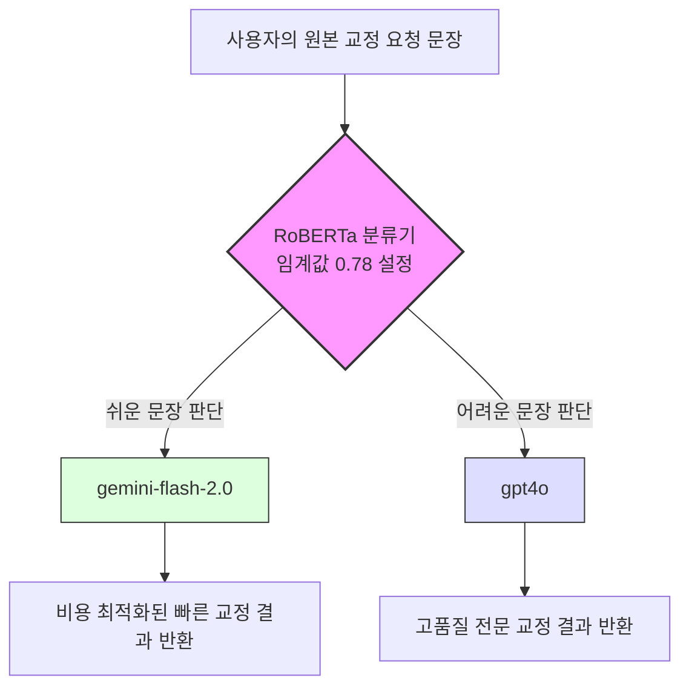

# **🧠 SmartRouter: 동적 라우팅 파이프라인 개발 프로젝트**

## **1. Project Overview**

- **프로젝트명**: 문장 교정 서비스 로그 기반 LLM 동적 라우팅 파이프라인 구축
- **수행 기간**: 2024년 (이어드림스쿨 실무 프로젝트)
- **핵심 역할**: 팀장 (팀 작업 조율, 데이터 정제/분석, ML 파이프라인 구축 및 최종 모델링 주도)
- **기술 스택**: Python, Pandas, scikit-learn, PyTorch, Transformers(HuggingFace), RoBERTa
- **GitHub 링크**: `[여기에 3단계에서 만들 GitHub URL을 넣어주세요`

---

## **2. Architecture Flow (라우팅 아키텍처)**

---

## **3. 세부 수행 내용 (STAR)**

### **🔍 Background (비즈니스 문제 정의)**

- **현황**: 협력 스타트업의 문장 교정 서비스는 난이도와 무관하게 거의 모든 요청이 경량 모델(Gemini Flash)로 일괄 처리되고 있었습니다.
- **문제점**: 전문적인 교정이 필요한 어려운 문장에서 품질 저하가 발생하여 고객 이탈(Churn) 우려가 커졌습니다. 그러나 품질을 높이기 위해 무조건 고성능 대형 모델로 전환할 경우 막대한 추론 비용(Inference Cost)이 발생하므로, 성능과 비용의 최적 균형을 찾는 구조적 개선이 절실했습니다.

### **🎯 Goal (해결 목표)**

- '쉬운 문장'은 기존대로 경량 모델로, '어려운 문장'만 고성능 대형 모델로 우회시키는 **동적 라우팅 파이프라인** 기획 및 구축.
- 기업의 비즈니스 상황(비용 중시 vs 품질 중시)에 맞춰 라우팅 비율을 유연하게 제어할 수 있는 **튜닝 체계(Tunable Threshold)** 마련.

### **⚙️ Action (역할 및 구현 과정)**

- **데이터 기반 문제 원인 파악 (Pandas, scikit-learn)**
    - 서비스 로그를 분석하여 고객 이탈률에 영향을 미치는 핵심 변수 추출.
- **기준 데이터 파이프라인 구축**
    - 사용자 의도와 적용 분야를 기준으로 교정 난이도를 평가하는 7,700건의 기준 데이터 확보.
- **RoBERTa 라우터 모델 학습 (PyTorch, Transformers)**
    - 표면적인 '글자 수' 기반 분류의 한계를 극복하기 위해, 한국어 문맥 파악에 뛰어난 'RoBERTa' 임베딩 기반 이진 분류기(Binary Classifier) 전면 배치.
- **임계값(Threshold) 최적화 튜닝**
    - 분류 기준인 임계값을 변수로 설계. 정밀도(Precision)와 재현율(Recall)의 균형점인 **F1 Score 최고점(0.78)**을 기본 임계값으로 설정하여 유연한 라우팅 비율 제어 구조 완성.

### **🏆 Result (최종 성과)**

- **비즈니스 최적화 성과**: 무조건적인 대형 모델 전환 시 발생할 비용 증가를 억제하면서도, 서비스 품질을 적절한 수준으로 상향시켜 비용과 성능의 경제적 균형 완성.
- **프로젝트 수상**: 비즈니스 목적을 파악하고 실무적 효율을 극대화한 유효성을 인정받아 **「2025년 스타트업 연계 프로젝트 장려상 (3등)」** 수상.
